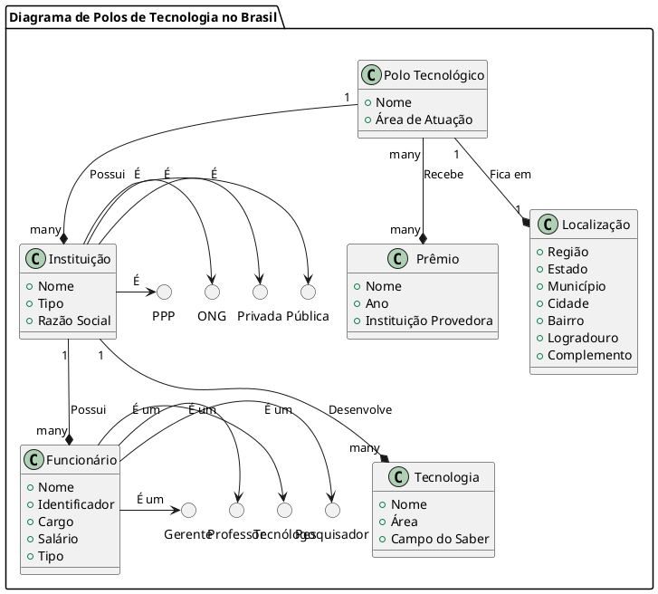

# Polos Tecnológicos do Brasil

## Uma análise de Arquitetura da Informação

```plantuml
@startuml
package "Diagrama de Polos de Tecnologia no Brasil" #FFFFFF {
  class "Polo Tecnológico" {
    + Nome
    + Área de Atuação
  }

  class Prêmio {
    + Nome
    + Ano
    + Instituição Provedora
  }

  class Instituição {
    + Nome
    + Tipo
    + Razão Social
  }

  circle Pública
  circle Privada
  circle ONG
  circle "PPP"

  class Localização {
    + Região
    + Estado
    + Município
    + Cidade
    + Bairro
    + Logradouro
    + Complemento
  }

  class Funcionário {
    + Nome
    + Identificador
    + Cargo
    + Salário
    + Tipo
  }

  circle Pesquisador
  circle Professor
  circle Tecnólogo
  circle Gerente

  class Tecnologia {
    + Nome
    + Área
    + Campo do Saber
  }

  "Polo Tecnológico" "1" --* "1" "Localização" : Fica em
  "Polo Tecnológico" "many" --* "many" Prêmio : Recebe

  "Polo Tecnológico" "1" --* "many" Instituição : Possui
  "Instituição" "1" --* "many" Funcionário : Possui

  "Instituição" "1" --* "many" Tecnologia : Desenvolve
  "Instituição" -> Pública : É
  "Instituição" -> Privada : É
  "Instituição" -> ONG : É
  "Instituição" -> PPP : É

  "Funcionário" -> Pesquisador : É um
  "Funcionário" -> Tecnólogo : É um
  "Funcionário" -> Professor : É um
  "Funcionário" -> Gerente : É um
}
@enduml
```
